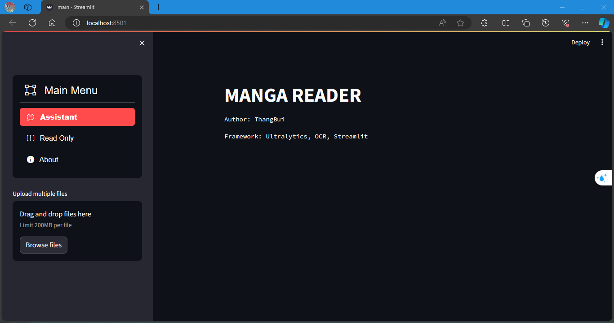
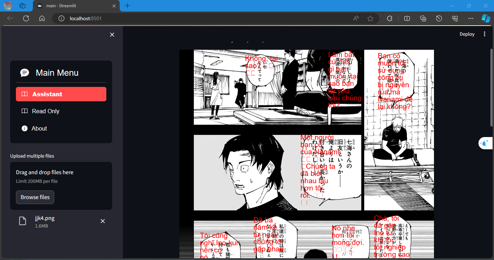
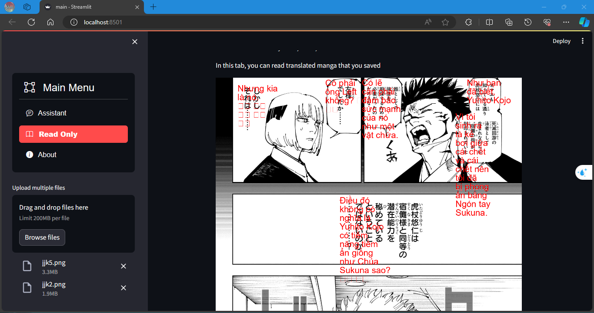
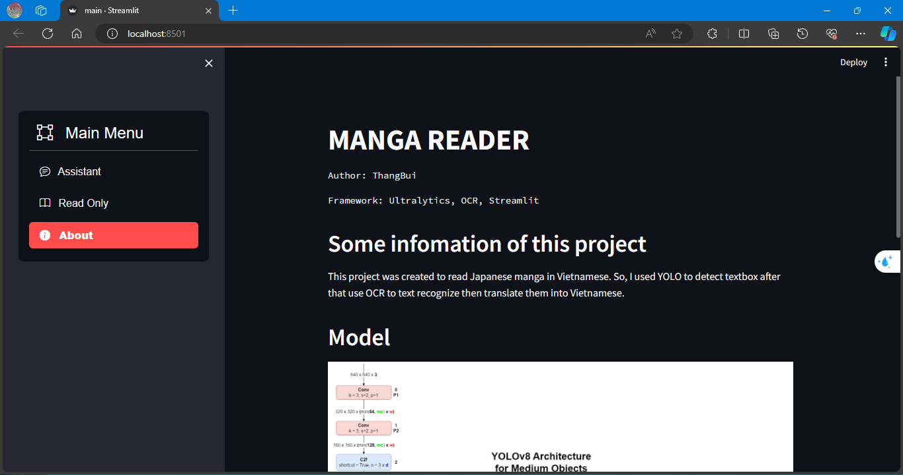

# Manga_reader_assistant

- **Author: ThangBui**
- **Major: Computer Vision & AI**
- **A student in the last year of MTA**
---
This is my mini-project where I employ Computer Vision techniques to enhance the experience of reading Japanese manga. With a focus on assisting readers, this project aims to automatically translate the language of the manga.

This app was created to read Japanese manga in Vietnamese. So, I used YOLO to detect textbox after that use OCR to text recognize then translate them into Vietnamese.

This app contains 3 components:
- Detector (using YOLOv8)
- Text recognize (using Manga-OCR)
- Web UI (using Streamlit)

With this app you can upload an image that is a page of your favourtie manga in Japanese. After that, this app will detect and convert text to Vietnamese.

---
### Install
1. __Require__
- Python >= 3.10
- Anaconda
- The weights file of model in [here](https://drive.google.com/file/d/1-XpMOB8wN1j1d57iq6JBLyzAQlPmyLoV/view?usp=drive_link)
2. __Download this Repos__
3. __Use conda to create a Python enviroment__
4. __Open this project and setup__
```
pip install -r requirements.txt
```
5. __Run this app__
```
streamlit run main.py
```
---
#### This app

---
#### An example results
##### Reader assistant

##### Reader translated manga

##### About

---