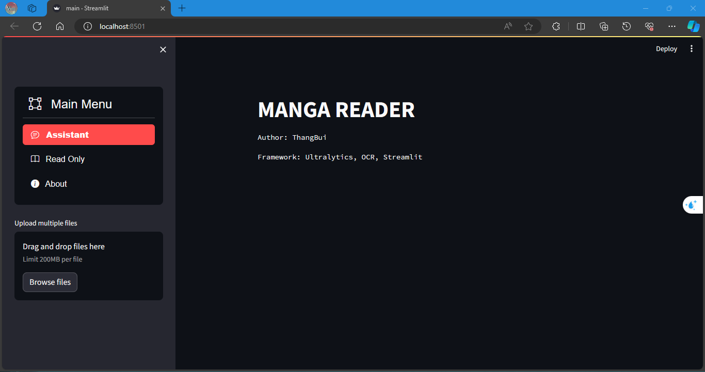
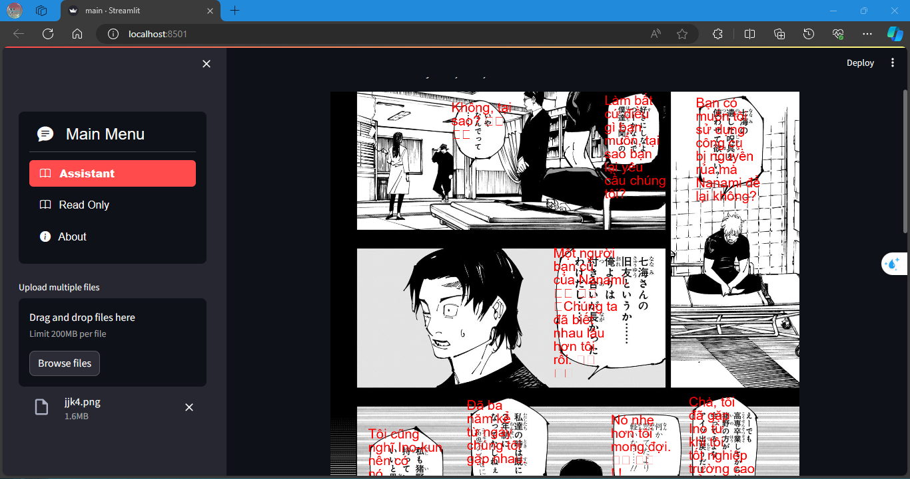
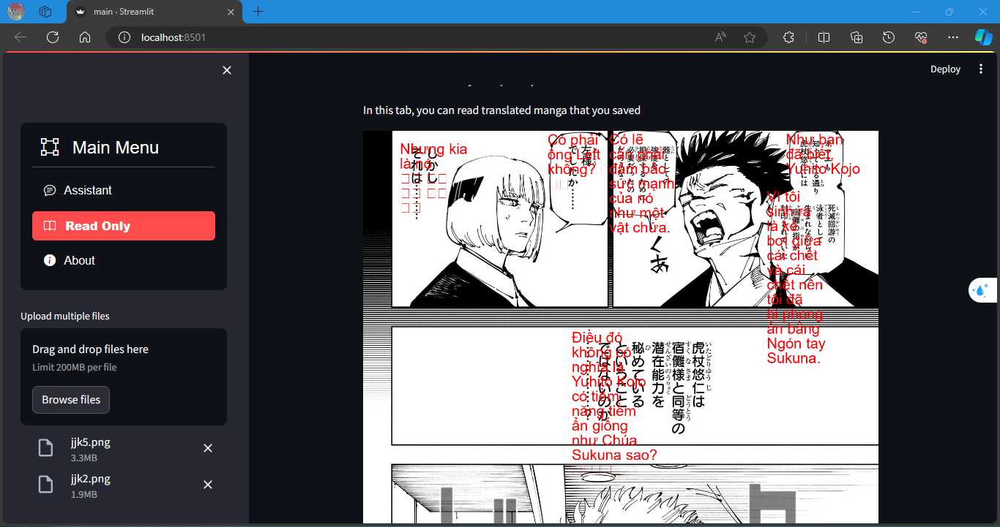
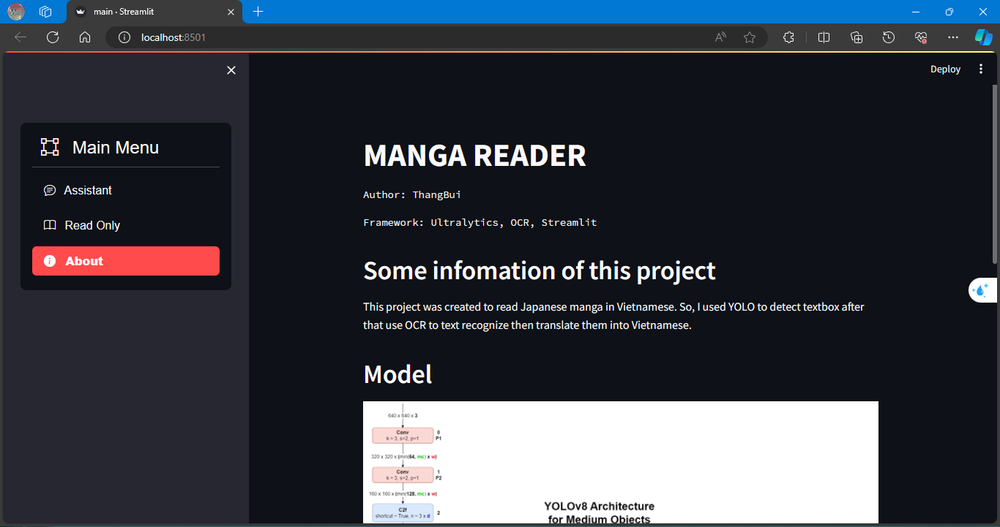

# Manga_reader_assistant

- **Author: ThangBui**
- **Major: Computer Vision & AI**
- **A student in the last year of MTA**
---
This is my mini-project where I employ Computer Vision techniques to enhance the experience of reading Japanese manga. With a focus on assisting readers, this project aims to automatically translate the language of the manga.

This app was created to read Japanese manga in Vietnamese. So, I used YOLO to detect textbox after that use OCR to text recognize then translate them into Vietnamese.

This app contains 3 components:
- Detector (using YOLOv8)
- Text recognize (using Manga-OCR)
- Web UI (using Streamlit)

With this app you can upload an image that is a page of your favourtie manga in Japanese. After that, this app will detect and convert text to Vietnamese.

---
### Install

#### 1. Requirements
- Python >= 3.10
- Anaconda (recommended) or venv
- Roboflow account (free) for model access

#### 2. Installation

```bash
# Clone repository
git clone https://github.com/ThangDuc3101/Manga_reader_assistant.git
cd Manga_reader_assistant

# Install dependencies
pip install -r requirements.txt
```

#### 3. Setup Roboflow API Key

This app uses **Roboflow Manga Bubble Detector** (trained on 4,492 manga images) with automatic fallback to YOLOv8s.

**Option A: Using .env file (Recommended)** ✅

```bash
# 1. Copy the template file
cp .env.example .env

# 2. Get your free API key
# Open: https://roboflow.com/settings/api
# Copy your "Private API Key"

# 3. Edit .env and replace the key
# (On Linux/Mac)
nano .env
# OR (On Windows)
notepad .env

# 4. Find this line and replace it:
# ROBOFLOW_API_KEY=[REDACTED:api-key]
# With your actual key:
# ROBOFLOW_API_KEY=abc123xyz...
```

**Option B: Environment Variable**

```bash
export ROBOFLOW_API_KEY="your_api_key_here"
```

**Option C: No Setup (Use YOLOv8s Base Model)**

- Just run the app - it will auto-download YOLOv8s model
- Less optimized for manga but works offline
- Set `USE_ROBOFLOW = False` in config.py

#### 4. Run the App

```bash
streamlit run main.py
```

Open browser: **http://localhost:8501**

---

### 📝 Getting Your Roboflow API Key

1. Go to [roboflow.com](https://roboflow.com) and sign up (free)
2. Navigate to **Settings** → **Roboflow API**
3. Copy your **Private API Key**
4. Paste into `.env` file: `ROBOFLOW_API_KEY=your_key_here`
5. Save and restart the app

**Note**: Keep your API key private! The `.env` file is in `.gitignore` for safety.

---

### 🆘 Troubleshooting

**"API key invalid" error**:
- Check your .env file has correct key
- Verify key from [roboflow.com/settings/api](https://roboflow.com/settings/api)
- Make sure no extra spaces or quotes

**App starts without error but detection fails**:
- Check your internet connection
- Try YOLOv8s fallback: set `USE_ROBOFLOW = False` in config.py

**More help**: See [MODEL_SETUP.md](MODEL_SETUP.md)

---
#### This app

---
#### An example results
##### Reader assistant

##### Reader translated manga

##### About

---